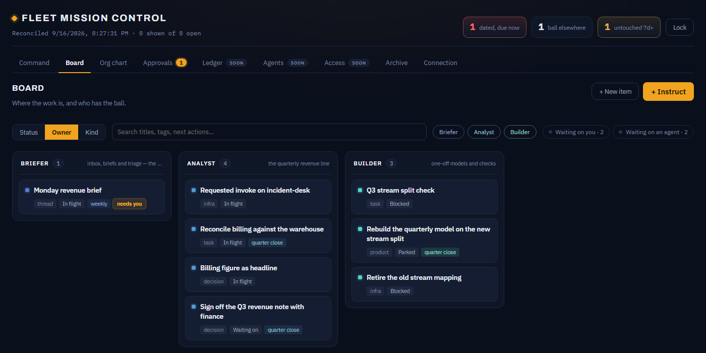

# Enterprise Brain

[](https://github.com/aviralmathur/enterprise-brain/actions/workflows/ci.yml)
[](LICENSE)
[](platform/package.json)

A **control plane for a fleet of AI-employee agents**, packaged as two Claude Code skills.
It sits *above* a single chief-of-staff orchestrator and answers the two questions a growing
fleet forces: **"who should do this?"** (routing) and **"where does what each agent knows
actually live?"** (per-agent memory).

It is the companion to the [orchestrator-agent-kit](https://github.com/aviralmathur/orchestrator-agent-kit):
that kit teaches how *one* agent behaves; this one builds the *org* those agents sit on.

> **Two things live in this repo now.** The skills below are the *personal* control
> plane — one principal, one fleet, on one machine. [`platform/`](platform/) is the
> *enterprise* build: many employee fleets, a platform-owned enterprise fleet, a
> shared output ledger between them, and a Mission Control for each side that you
> can actually open — an employee's private cockpit and the platform team's
> governance desk:
>
> | Fleet Mission Control | Platform Mission Control |
> |---|---|
> | [](platform/docs/walkthrough.md) | [](platform/docs/walkthrough.md) |
>
> ```bash
> cd platform && node serve.mjs --seed   # then open /fleet and /platform
> node platform/demo-cascade.mjs         # or just watch the cascade in 20s
> ```
>
> They share a name and an idea; they are separate codebases with separate
> audiences. Start with the skills if you run your own fleet; start with
> [`platform/README.md`](platform/README.md) — or the
> [walkthrough](platform/docs/walkthrough.md) — if you are standing this up for an
> organisation.

## What's in here

```
skills/
  enterprise-brain/   ← the control plane: roster, routing, fleet-wide rules, the memory model
  cerebro/             ← the knowledge lane: an LLM-Wiki librarian ("second brain") for durable world-facts
example/              ← a tiny fictional 3-agent fleet, filled in, so you can see the shape
platform/             ← the enterprise build: output ledger, provenance cascade, registry,
                        grants, invoke gateway, two Mission Controls, and an employee fleet kit
```

- **`enterprise-brain`** owns the roster, the routing table, one set of fleet-wide rules, and
  a memory model that gives every agent its own namespace instead of one shared pile. It
  dispatches; it does not do a specialist's work. Full contract in
  [`skills/enterprise-brain/SKILL.md`](skills/enterprise-brain/SKILL.md).
- **`cerebro`** is the single-writer librarian for cross-cutting knowledge — ingest a source,
  it files durable notes; ask "what do we know about X", it answers with provenance.

## Quickstart

```bash
git clone https://github.com/aviralmathur/enterprise-brain
cd enterprise-brain
./init.sh
```

`init.sh` prompts for the six org-level values (the brain's name, the principal, the org,
where charters and memory live, the librarian's name, an optional board command), then:

- fills the placeholders and writes your **control plane** to `~/agents/_control/`
  (`roster`, `routing`, `how-we-work`, `who`, `environment`, `memory-model`),
- scaffolds your **memory tree** (`_shared/`, `_unassigned/`, the librarian's folder, a
  sectioned `MEMORY.md`) — **an existing `MEMORY.md` is never overwritten**, so it is safe to
  run over a store you already have,
- and — if you give it a skills dir — copies and fills the two **skills** into it.

It runs non-interactively too (for CI or scripting):

```bash
BRAIN=Jarvis PRINCIPAL="Jane Doe, VP Eng" ORG=Acme \
  AGENTS_ROOT=~/agents MEM_ROOT=~/.claude/memory INSTALL_SKILLS=~/.claude/skills ./init.sh
```

Only the org-level placeholders are filled; the per-agent `{{AGENT}}` is left for when you
onboard each agent (SKILL §5.4). You can adopt all of this **on top of an existing flat memory
store without moving a file on day one** (the lazy-migration path, §4.6).

<details>
<summary>Prefer to do it by hand?</summary>

1. `cp -r skills/enterprise-brain skills/cerebro ~/.claude/skills/`
2. Fill the placeholders (`{{BRAIN}}`, `{{PRINCIPAL}}`, `{{ORG}}`, `{{MEM_ROOT}}`,
   `{{AGENTS_ROOT}}`) — see §0 of the enterprise-brain SKILL.md.
3. `mkdir -p ~/agents/_control && cp skills/enterprise-brain/templates/{roster,routing,how-we-work,who,environment,memory-model}.md ~/agents/_control/`
4. Create the memory tree (a folder per agent + a small shared core + a sectioned `MEMORY.md`) — §4.
5. Wire your agents in **one at a time** (§5.4).
</details>

## Check the fleet against itself

Once it is running — and every time you add or retire an agent — run:

```bash
./validate.sh
```

It asserts the control plane is complete; every roster row has a routing entry and a memory
namespace, **and the reverse** (a namespace folder with no roster row is a retired agent still
on disk); every `owner:` resolves to a real agent or `shared`; `_shared/` is inside its budget,
and that a budget exists at all; and every `[[wikilink]]` lands. Exit 0 when clean, 1 on any
error, so it drops straight into CI or a pre-commit hook.

```bash
SKILLS_DIR=~/.claude/skills ./validate.sh   # also catch a skill that never got substituted
./validate.sh --example                     # run it against the reference fleet below
```

Every check corresponds to a defect that was once live in this repo — see
[`KNOWN-ISSUES.md`](KNOWN-ISSUES.md).

See [`example/`](example/) for a filled-in reference to copy from.

## The two problems it solves

1. **Routing.** Misrouted work is the most expensive waste in a fleet — two agents quietly
   duplicating each other for months. The control plane makes "who owns this" a lookup.
2. **Memory.** A single flat store shared by every agent is where facts rot. Per-agent
   namespaces + a small capped shared core + an ownership contract fix it.

## Memory model at a glance

One folder per agent, plus a small shared core — no separate wiki:

- **`_shared/`** — the always-on core every agent loads: identity, environment, the never-miss
  people, fleet-wide rules. Capped (budgeted), tagged `owner: shared`.
- **`<agent>/`** — each agent's private namespace. Loads only when that agent runs.
- **The librarian's folder** (`cerebro/` in the reference deployment) — cross-cutting
  knowledge no single lane owns, written as **flat notes**, paged in on demand. It follows the
  LLM-Wiki / "second brain" pattern (ingest → provenance → cross-links) *without* a separate
  `wiki/{sources,entities,concepts,synthesis}` taxonomy: the per-agent folders are the
  structure, wikilinks are a convenience.

You can adopt this on top of an existing flat store without moving a file on day one — see
the lazy-migration path (§4.6 of the SKILL).

## License

MIT — see [`LICENSE`](LICENSE).
