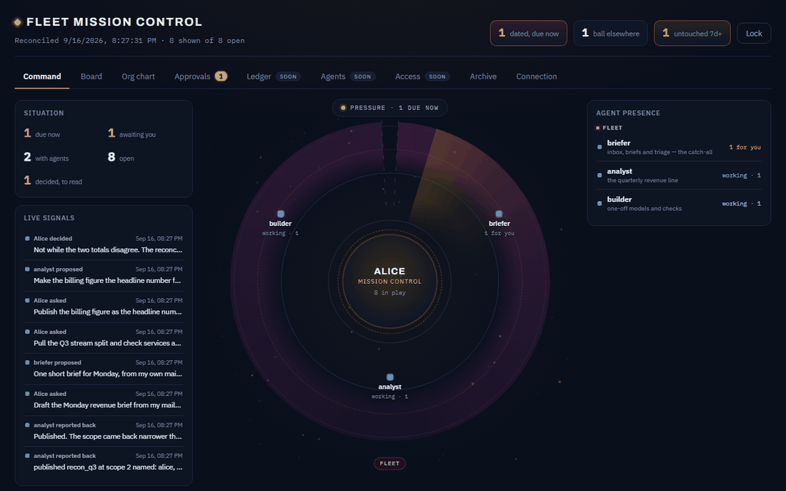

# Enterprise Brain

[](https://github.com/aviralmathur/enterprise-brain/actions/workflows/ci.yml)
[](LICENSE)
[](platform/package.json)

**Everyone in a company is about to have their own AI agents. Enterprise Brain is the layer
that lets those agents share what they know — without one of them quietly leaking a figure,
laundering a restricted one, or repeating something that stopped being true last week.**

It gives you two things: a **shared ledger** every agent publishes to and reads from under real
access rules, and a **Mission Control** — a board where a person sees what their agents are
doing and says yes or no.



> Every frame is a real screenshot of the shipped seed. Run `node serve.mjs --seed` and you get
> exactly this.

---

## The problem

Give a hundred employees their own agents and you get a hundred private silos. Each re-derives
the same numbers, none agree, and nobody can tell which figure is current. The obvious fix —
one big shared knowledge base — is worse: now anything one agent writes is something every
other agent believes.

What you actually need is narrower:

- an agent reads what it is **entitled** to read, and nothing more
- anything it produces carries **where that came from**
- when a fact is corrected, **everything built on it finds out**
- and a **person** stands behind anything that leaves

That is the whole of Enterprise Brain.

---

## The core idea: two kinds of fleet

There are two kinds of agent fleet. They are governed completely differently, and keeping them
apart is what makes the thing safe.

```
        ┌───────────────────────────────────────────────┐
        │             ENTERPRISE FLEET                   │
        │    owned and reviewed by the platform team     │
        │   revenue-desk · incident-desk · people-desk   │
        └────────────────────┬──────────────────────────┘
                             │  publishes outputs
                             ▼
                 ╔═══════════════════════╗
                 ║   THE SHARED LEDGER   ║  ← scope computed, provenance kept
                 ╚═══════════════════════╝
                    ▲                  │
      writing up    │                  │   reading down
    ALWAYS GATED    │                  │   open, but scope-filtered
                    │                  ▼
        ┌───────────┴───────────────────────────────────┐
        │              EMPLOYEE FLEETS                   │
        │    anyone may create one, no approval needed   │
        │    Alice's briefer/analyst/builder · Bob's …   │
        └───────────────────────────────────────────────┘
```

|  | **Enterprise fleet** | **Employee fleet** |
|---|---|---|
| Who owns it | the platform team | one employee |
| Getting one | reviewed onboarding, a manifest per agent | **self-serve — nobody's permission needed** |
| What it does | publishes trusted outputs on a cadence | that employee's own work |
| Reading the ledger | it *is* the source | open, filtered to what that employee may see |
| Writing to the ledger | direct | **only through the approve gate** — a human verdict |
| Its board | the review queue is the platform team's | **private — the platform team cannot read it** |
| Reach | reviewed at onboarding; org-wide over a service account is refused | its agents are the lanes on its own board |

**The asymmetry is deliberate.** Employee fleets read **down** freely — that is the point; the
enterprise's knowledge should be available. But writing **up** always passes a gate, because
anyone can spin up an employee fleet, and one injected document in an unvetted fleet must never
become an enterprise-wide fact.

**Invoking is separate from reading.** Being allowed to *read* an enterprise agent's outputs
does not let you *run* it. That takes a live, **time-boxed grant** issued to a named agent
inside a named fleet — and the gateway re-checks it on every call, because the client is never
trusted to have already checked.

---

## Mission Control

Two boards, because there are two owners. Neither can read the other's.

### Fleet Mission Control — one employee's private cockpit

The dark board in the loop above.

| View | What it answers |
|---|---|
| **Command** | *What is my fleet doing right now?* Every agent in orbit with what it's carrying, plus the live signal feed. |
| **Board** | *Where is the work?* Columns you can group by **Status**, **Owner** or **Kind**, narrowed with per-agent chips. A card opens a **drawer** with the whole thread. |
| **Org chart** | *Who reports to whom — and what is each lane allowed to do?* The owner, the orchestrator, every lane beneath it, and a card per lane stating what it **can** and **cannot** do. |
| **Approvals** | *What needs me?* Proposals waiting on a verdict. |

The drawer frame in the loop is the one to pause on. An agent's proposal is **structured** — an
understanding, concrete actions, what it will deliberately **not** do, and where its answer came
from. Beneath it sits the candidate output and its `DERIVED FROM` edges. That is what a person
approves: not a vibe, a specific thing with its inputs named.

### Platform Mission Control — the governance desk

The light board. Outputs by state and status, the grant review queue, and the two things a fleet
board never has: **Audit by action** — every consume, invoke, grant and auth decision with its
refusal count — and **Live conflicts**, where two disagreeing figures are surfaced and
deliberately *not* resolved. The brain never picks a winner; a person does.

---

## What makes it a brain and not a wiki

Two properties. You can watch both in about twenty seconds:

```bash
cd platform && node demo-cascade.mjs
```

**1 · A derived output's audience is computed, never declared.**

```
rev_q3       3 named: alice, bob, dave
billing_q3   2 named: alice, bob
recon_q3     2 named: alice, bob      ← the INTERSECTION of its inputs
```

The analyst never set that scope; the ledger intersected the inputs. Restricted data cannot be
laundered into a wider audience by deriving something from it, and an agent cannot widen its own
output — ever.

**2 · Correct one figure and everything built on it goes stale by itself.**

```
rev_q3       stale     ← superseded by a correction
recon_q3     stale     ← nobody touched it; the derived_from edge did this
```

That single property — the `derived_from` edge plus the cascade — is why this is a ledger and
not a shared folder. Superseding is **owner-only**: an employee fleet cannot stale an enterprise
output it doesn't own.

---

## Try it in two minutes

No dependencies. Node 18+.

```bash
git clone https://github.com/aviralmathur/enterprise-brain
cd enterprise-brain/platform

node serve.mjs --seed     # both boards, seeded, with sign-in links printed
node demo-cascade.mjs     # the cascade and computed scope, on real ledger state
node acceptance/run.mjs   # 89 checks — every rule proved, not asserted
```

`--seed` prints two links that sign you straight in, one per board. A second worked example,
`node northwind.mjs`, seeds a different fleet — an ops team reconciling two disagreeing on-time
figures — on the same surface.

No build step. The boards are static files, and the token rides in the URL fragment, which never
reaches the server.

---

## Implementing it for your org

**1 · Read the contract first.** [`platform/spec/contracts.md`](platform/spec/contracts.md) is
the Phase 0 decision everything downstream hardcodes, and it is two pages. Security should sign
it before any gateway code exists — retrofitting an authorization model is a rewrite.

**2 · Replace the four seams.** Everything else is real. These four are interfaces with a local
implementation behind them, because none can exist on a laptop as itself:

| Seam | Swap in |
|---|---|
| `brain/identity.mjs` | your IdP. `resolve(id) → { id, status, entitlements }` is the whole surface |
| `platform-fleet/tokens.mjs` | whatever mints your tokens — OIDC, an internal STS, mTLS |
| `platform-fleet/connectors/` | real vendor clients. `normalise()` does not change |
| `brain/store.mjs` | Postgres, S3 — `load(name)` / `save(name, doc)` is the entire contract |

**3 · Onboard your enterprise agents.** A reviewed manifest each. Scope review **blocks**
org-wide reach over a service account; the remedy is a narrower scope, or marking the agent
platform-internal so it publishes outputs instead of being reachable.

**4 · Let employees self-serve.** They need nobody's permission.
[`platform/kit/skills/`](platform/kit/skills/) is what an employee installs — six skills, one
file each: setup, consume, publish, invoke, access, board. When registering a fleet, declare each
lane's `orchestrator`, `reports_to`, `can` and `cannot`. That is what the org chart renders, and
a lane's authority cannot be inferred from its name.

**5 · Host it.** One pure request handler, so it deploys as a single serverless function —
[`platform/DEPLOY.md`](platform/DEPLOY.md). Treat the hosted store as **single-writer** until it
is backed by something with real compare-and-set.

Full walkthrough with screenshots: [`platform/docs/walkthrough.md`](platform/docs/walkthrough.md).

---

## The other half: one person's own fleet

`platform/` governs an organisation. [`skills/`](skills/) is the smaller idea it grew out of: a
**control plane for one person's fleet of AI employees**, as two Claude Code skills. It answers
the two questions a growing personal fleet forces — *"who should do this?"* (routing) and
*"where does what each agent knows actually live?"* (per-agent memory).

```bash
./init.sh          # scaffolds the control plane and the memory tree
./validate.sh      # checks the fleet against itself
```

`init.sh` writes a roster, a routing table, one set of fleet-wide rules, and a memory model that
gives every agent its own namespace instead of one shared pile — adoptable **on top of an
existing flat memory store without moving a file on day one**. `validate.sh` then asserts that
every roster row has a routing entry and a namespace (and the reverse — a namespace with no row
is a retired agent still on disk), every `owner:` resolves, `_shared/` is inside its budget, and
every `[[wikilink]]` lands.

They share a name and an idea; they are separate codebases with separate audiences. Start at
[`skills/enterprise-brain/SKILL.md`](skills/enterprise-brain/SKILL.md), or
[`example/`](example/) for a filled-in reference fleet.

---

## What's in the repo

```
platform/          the enterprise build
  brain/           the ledger: computed scope, the provenance cascade, tombstones
  platform-fleet/  registry, grants, the invoke gateway, the review queue
  employee-fleet/  one employee's board, tool selection, the platform link
  ui/              the two Mission Controls — static files, no build step
  kit/skills/      what an employee installs to use the brain
  spec/            the Phase 0 contracts
  acceptance/      89 runnable checks
skills/            the personal control-plane kit (+ cerebro, the librarian)
example/           a filled-in fictional 3-agent fleet
```

## On trusting any of this

Every rule above is enforced by code and proved by a check that fails without it — including an
adversarial phase whose every entry was **red before its fix**: a fleet cannot supersede an
output it doesn't own, cannot derive from one it cannot read, cannot widen a scope through the
lattice, and an unclassified vendor op defaults to needing a human.

What is *not* solved is written down too —
[`platform/README.md` § Known gaps](platform/README.md) and
[`KNOWN-ISSUES.md`](KNOWN-ISSUES.md). A gap you can read beats a claim you can't.

## Contributing

Contributions are welcome. **Email aviral@fdefieldguide.com** — contributors reach out
directly and get a reply. Worth doing before a large change, and especially if you adopted the
kit for a real org and something in it fought you.

Read [`CONTRIBUTING.md`](CONTRIBUTING.md) first: `skills/` and `platform/` share a name and an
idea, not a codebase, and every change comes with a check that was red before it. Security
findings go through [`SECURITY.md`](SECURITY.md), not a public issue.

## License

MIT — see [`LICENSE`](LICENSE).
