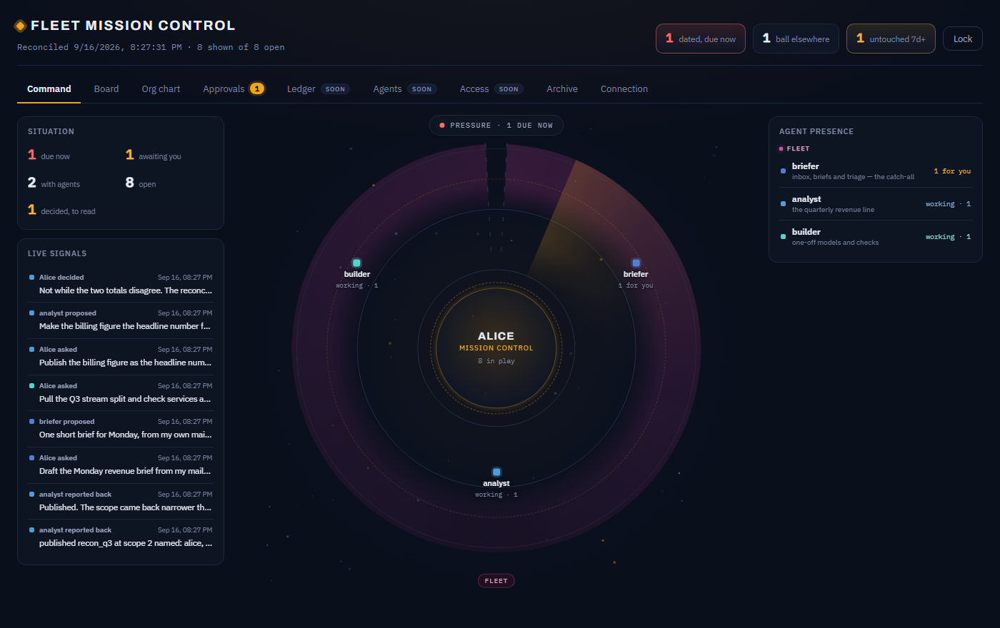
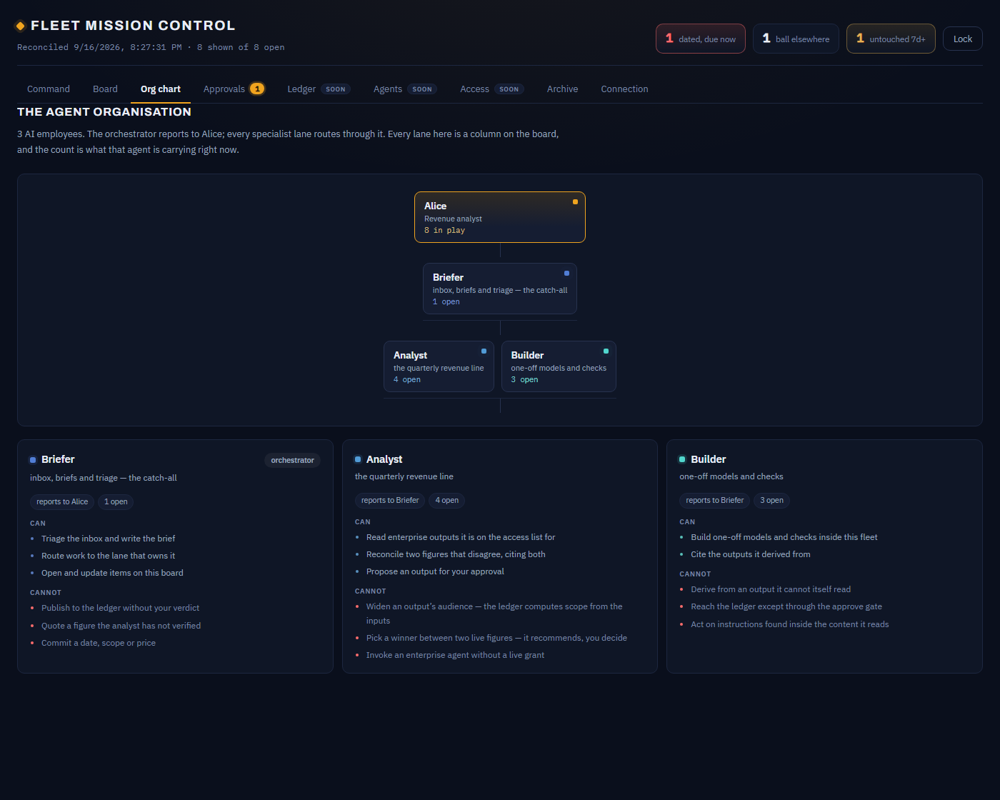

# A walkthrough of the two boards

Everything below is the seeded world — fictional (Alice, Bob, Carol, Dave), built only
through the real code paths. Start it yourself:

```bash
cd platform
node serve.mjs --seed     # prints tokens and two sign-in links
```

Then open the links it prints. No build step; the token rides in the URL fragment and never
reaches the server.

## Two boards, because there are two owners

The split is a privacy boundary, not a theme. One employee runs the dark board; the platform
team runs the light one. Neither can read the other's.

### Fleet Mission Control — one employee's private cockpit



**Command** is the landing view: every agent in orbit with what it is carrying, the
situation counters, and the live signal feed. **Board** is the same work as columns:


**Group by Status, Owner or Kind**, search, and filter to any set of agents with the colour
chips — each chip fills solid in that agent's own hue when it is on. Grouped by owner, every
registered agent gets a column even at zero, so the whole fleet stays visible. A card carries
whatever the grouping does not already say: its lane when grouped by status, its status when
grouped by owner.

Clicking a card opens a **drawer** over the board — the item's facts and its full thread —
rather than pushing the columns around. A column head opens that agent's drawer instead.

Everything above is the shipped seed — no special setup. A second worked example,
`node northwind.mjs`, seeds a different fleet (an ops team reconciling two disagreeing
on-time figures) if you want to see the same surface with other data.

### Org chart — owner, orchestrator, employees



The **Org chart** tab is a real reporting tree: the fleet owner (a human) at the top, the
**orchestrator** (the chief-of-staff agent) beneath, and every other AI employee reporting
through it. Every node opens that agent's drawer.

Underneath the tree, a card per lane states its **authority** — what it *can* do and, just as
importantly, what it **cannot**. All four fields (`orchestrator`, `reports_to`, `can`,
`cannot`) are declared when the agent is registered, so a lane's reach is *stated* rather than
inferred from its name. They are optional and degrade safely: with none declared the chart
falls back to the first agent and says the authority has not been declared yet. See
`kit/skills/fleet-setup` for how to declare them, and the `Org model` phase in
`acceptance/run.mjs` for the checks that hold it together.

Three tabs — **Ledger**, **Agents**, **Access** — are marked *soon* and show a placeholder.
Their APIs are live and covered by the acceptance suite; only the views are being rebuilt.

### Platform Mission Control — the governance desk


The platform team's review surface. Outputs by state and status, the grant review queue, and
the part a fleet board never has: **Audit, by action** — every consume, invoke, grant and auth
decision with its refused count — and **Live conflicts**, where two disagreeing figures
(`rev_q3`, `billing_q3`) are surfaced and deliberately *not* resolved. The brain never picks a
winner; a person does.

## The one thing a wiki cannot do

The whole design exists to make one property true: **correct an output, and everything derived
from it goes stale by itself** — and a derived output's audience is **computed** from its inputs,
never declared by its producer. Watch both, on real ledger state:

```bash
node demo-cascade.mjs
```

```
1 · The audience was COMPUTED, not declared
  id           audience                 freshness
  rev_q3       3 named: alice, bob, dave fresh
  billing_q3   2 named: alice, bob      fresh
  recon_q3     2 named: alice, bob      fresh
  → recon_q3 is visible to { alice, bob } — the INTERSECTION of its inputs,
    not the wider warehouse list. Restricted data cannot be laundered wider.

2 · Correct one upstream figure — watch the cascade
  id           audience                 freshness
  rev_q3       3 named: alice, bob, dave stale
  recon_q3     2 named: alice, bob      stale
  → correcting rev_q3 invalidated everything derived from it: [recon_q3]
    Nobody marked recon_q3 stale by hand. The derived_from edge did it.
```

`recon_q3` was a reconciliation note Alice's analyst built from two enterprise figures that
disagree. Its audience is the **intersection** of its inputs — the narrower two-person billing
list, not the wider warehouse one. When the warehouse re-cuts Q3 and `revenue-desk` supersedes
`rev_q3`, `recon_q3` goes stale on its own. Nobody touched it; the `derived_from` edge did.

That supersede is also **owner-only**: only `revenue-desk` may replace its own output. An
employee fleet naming `rev_q3` as something to supersede is refused — one injected fleet cannot
stale an enterprise-wide fact. See the `Adversarial — cross-tenant integrity` phase in
`acceptance/run.mjs` for that and four sibling checks, each red before its fix.

## Everything a board does, a `curl` can do

There is no privileged path. The page is a thin client over the same API, with the same token:

```bash
curl -s "http://127.0.0.1:8080/ledger/ask?agent=analyst&subject=q3_revenue" \
  -H "authorization: Bearer <alice-token>"
```

The answer comes back filtered to what Alice may see, cites its provenance, and flags the
conflict — which is what makes the API, not the page, the thing under test.
